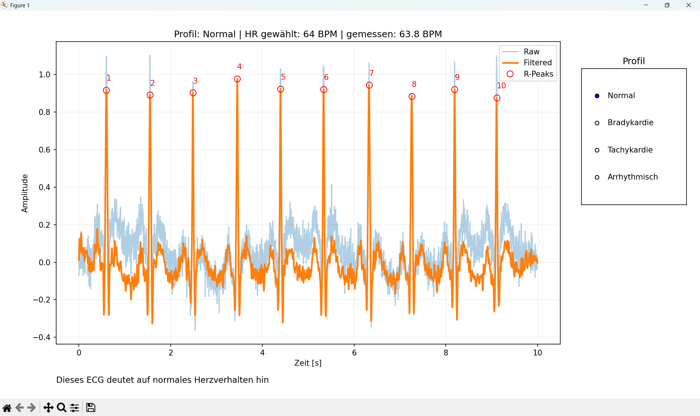
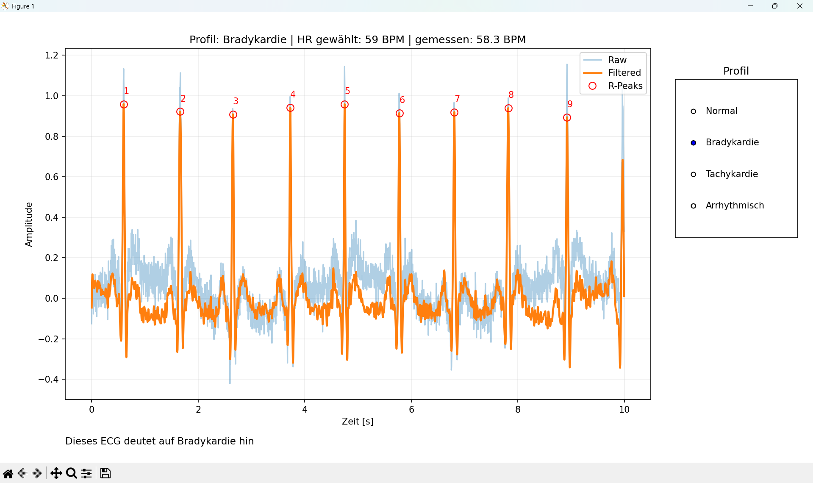
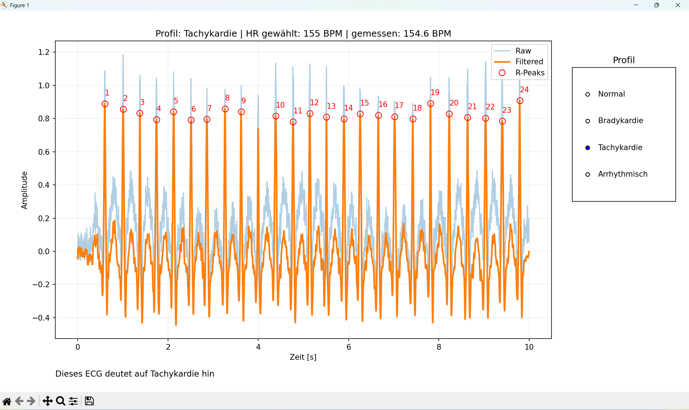
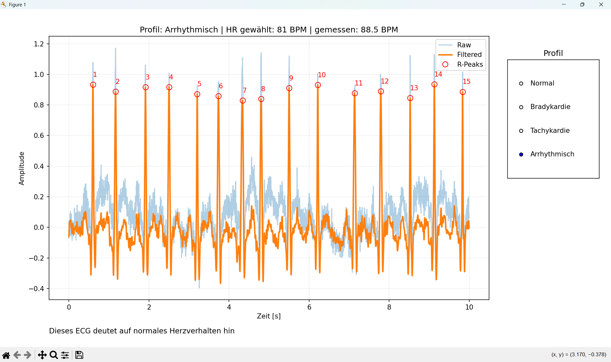

# ECG Signal Simulator & Rhythm Classification

This project simulates realistic ECG signals and performs a rule-based
analysis to classify cardiac rhythm behavior.

The application was developed for educational and portfolio purposes
and is **not intended for clinical diagnosis**.

---

## Features

- Synthetic ECG generation (P, Q, R, S, T waves)
- Adjustable heart rate profiles:
  - Bradycardia (30–60 BPM)
  - Normal rhythm (60–100 BPM)
  - Tachycardia (100–160 BPM)
  - Arrhythmic rhythm (high RR variability)
- Signal artifacts:
  - Baseline drift
  - 50 Hz powerline interference
  - Sensor noise
- Digital filtering:
  - High-pass filter (0.5 Hz)
  - Low-pass filter (40 Hz)
  - Notch filter (50 Hz)
- R-peak detection
- Heart rate (BPM) calculation
- Rule-based rhythm classification
- Interactive visualization using Matplotlib

---

## Technologies Used

- Python
- NumPy
- SciPy
- Matplotlib

---

## How It Works

1. An ECG signal is synthesized using Gaussian models for PQRST waves.
2. Noise and artifacts are added to simulate real-world measurements.
3. The signal is filtered using standard ECG preprocessing filters.
4. R-peaks are detected using peak detection.
5. Heart rate is calculated from RR intervals.
6. The rhythm is classified based on BPM thresholds.

---

## Screenshots

### Normal Rhythm

### Bradycardia

### Tachycardia

### Arrhythmia

---

## Disclaimer

This software is intended for educational and demonstration purposes only.
It must not be used for medical diagnosis or treatment.
